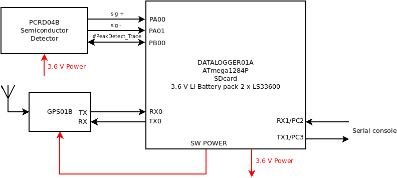
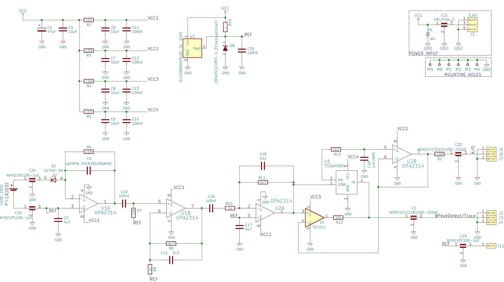

# AIRDOS02 - Airborne cosmic radiation dosimeter with GPS 

Cosmic radiation dosimeter unit. It is intended for airborne measurement of cosmic radiation and dosimetry in mixed ionization fields on board of aircraft. 

**Technical parameters are following:** 

* Silicon PIN diode detector with 60mm3 detection volume
* Measurement endurance 20 days
* Number of erengy channels    248
* Energy measurement resolution    <60 keV/channel
* GPS logging interval    10 minutes
* Time to GPS fix	26 s
* Airborne GPS parameters (navigation altitude verified up to 36km amsl)
* Integration time    10 s
* Size LxWxH 166 mm x 107 mm x 57 mm 
* Weight 0.85 kg (Without batteries and GPS antenna)

**Device block diagram**

**PCRD04B semiconductor detector schematics**

**Wire connection**

| DATALOGGER01A       | PCRD04B           | Color | Length |
| :-------------: |:-------------:| :-----:|:-----:|
| PB0     | TRACE | purple |10cm shield |
| GND     | POWER GND | black |10cm shield |
| VDD    | POWER VDD | orange |10cm shield |
| PA0     | A/D | yellow |10cm shield |
| PA1    | REF | grey |10cm shield |

| DATALOGGER01A       | GPS01A          | Color | Length |
| :-------------: |:-------------:| :-----:|:-----:|
| GND SWPOWER     | GND POWER | black |15cm |
| VDD SWPOWER     | VDD POWER | orange |15cm |
| TX0     | RX0 | orange |15cm |
| RX0     | TX0 | yellow |15cm |

**Jumper connection**

| GPS01B       |           | 
| :-------------: |:-------------:|
| USB     | OFF | 
| EXT.POWER     | EXT | 
| ANT.TYPE   | Active | 

| DATALOGER01A       |           | 
| :-------------: |:-------------:|
| SDVDD     |  | 
| POWER - BATERY     |  | 

The device can be purchased from [Universal Scientific Technologies s.r.o](http://www.ust.cz). Contact us by [email](sale@ust.cz) for an commercial quotation.

## Relevant publications

  * [AIRDOS — open-source PIN diode airborne dosimeter](https://iopscience.iop.org/article/10.1088/1748-0221/16/03/T03006)

